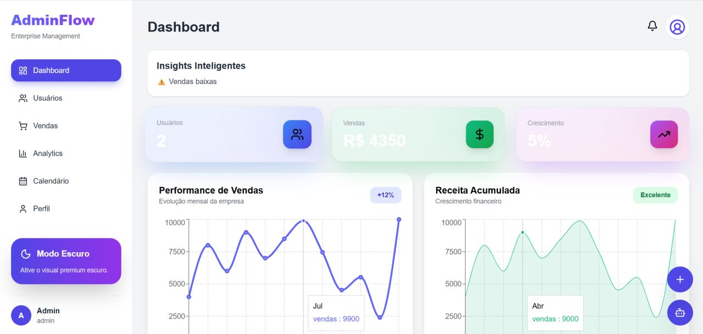

# 🚀 AdminFlow

<p align="center">
  Plataforma moderna de gestão empresarial com dashboard inteligente, autenticação segura e monitoramento em tempo real.
</p>

<p align="center">
  
  
  
  
</p>

---

## 📖 Sobre o Projeto

O AdminFlow é uma plataforma de gestão desenvolvida para centralizar informações empresariais em uma interface moderna, intuitiva e responsiva.

O sistema oferece autenticação segura, gerenciamento de usuários, acompanhamento de vendas, notificações em tempo real e análise de indicadores através de dashboards interativos.

Além das funcionalidades administrativas, o projeto foi desenvolvido com foco em experiência do usuário, organização visual e boas práticas de desenvolvimento.

---

## ✨ Funcionalidades

### 🔐 Segurança

* Login com autenticação JWT
* Controle de acesso por cargos
* Rotas protegidas
* Gerenciamento de sessão

### 📊 Dashboard

* Indicadores em tempo real
* Métricas de vendas
* Crescimento empresarial
* Visualização gráfica de dados

### 👥 Gestão de Usuários

* Cadastro de usuários
* Controle de permissões
* Perfil do usuário
* Gerenciamento administrativo

### 🔔 Recursos Inteligentes

* Sistema de notificações
* Feed de atividades
* Atualizações em tempo real
* Assistente inteligente

### 🎨 Interface

* Dark Mode
* Layout responsivo
* Dashboard moderno
* Experiência otimizada para o usuário

---

## 🛠 Tecnologias Utilizadas

### Front-end

* React
* Vite
* JavaScript
* Tailwind CSS

### Comunicação

* Socket.IO

### Integrações

* API REST
* JWT Authentication

---

## 🏗 Arquitetura

```text
Frontend (React + Vite)
          │
          ▼
Backend (Node.js + Express)
          │
          ▼
Banco de Dados (SQLite)

          ▲
          │
      Socket.IO
```

---

## 📸 Preview

### Dashboard



### Gestão de Usuários


---

## 🎯 Objetivos

* Centralizar dados empresariais
* Facilitar a tomada de decisões
* Melhorar a visualização de indicadores
* Automatizar processos internos
* Aplicar conceitos modernos de desenvolvimento web

---

## 🌱 Aprendizados

Durante o desenvolvimento deste projeto foram aplicados conhecimentos em:

* React
* Tailwind CSS
* APIs REST
* JWT
* Socket.IO
* UX/UI
* Integração Front-end e Back-end
* Segurança Web
* Arquitetura de Sistemas

---

## 🔗 Repositórios

### Front-end

https://github.com/AliceKaleno/AdminFlow-frontend

### Back-end

https://github.com/AliceKaleno/AdminFlow-backend

---

## 👩‍💻 Desenvolvido por

### Alice Maria

🎓 Técnica em Desenvolvimento de Sistemas

🔐 Graduanda em Cibersegurança

💻 Desenvolvedora Front-end

🌐 Portfólio: https://portifolio-as.vercel.app/

🔗 LinkedIn: https://www.linkedin.com/in/alice-maria-da-silva/

---

⭐ Se gostou do projeto, deixe uma estrela no repositório!
